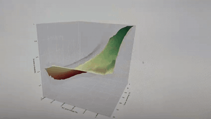
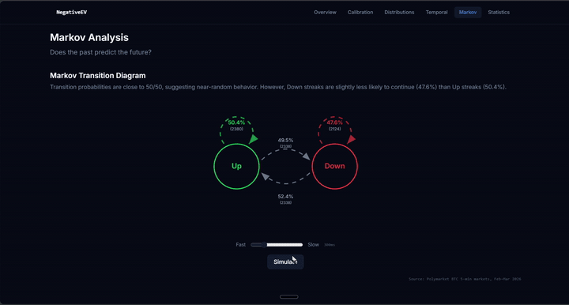

# COM-480 Milestone 2: NegativeEV

| Student | SCIPER |
|---|---|
| Anton Svet | 347212 |
| Santiago Rivadeneira | 339832 |
| Arthur Margeat | 330258 |

*Individual contribution by Santiago Rivadeneira, to be merged with the drafts from Anton and Arthur into the final team document.*

## 1. Project Goal

Polymarket recently launched **Bitcoin 5-minute prediction markets**: every five minutes a new market opens where users bet whether BTC will finish *Up* or *Down* relative to the opening price. Each round resolves in exactly 300 seconds, creating a rare *"wisdom of the crowds"* stress-test two orders of magnitude faster than any market traditionally studied.

**NegativeEV** asks one focused question: *"when the market implies a 70 % probability of Up, does Up actually occur 70 % of the time?"* We answer it visually, by comparing **observed outcome frequencies** against **market-implied probabilities** along the two dimensions that should drive them: **time remaining** inside the 5-minute round, and **BTC price momentum** since it opened. Target audience: researchers in market microstructure, quant practitioners benchmarking prediction models, and anyone curious whether ultra-short-horizon prediction markets really predict. A secondary goal is to make this high-frequency data **understandable for non-experts**, turning a noisy 16.8 M-trade dataset into an intuitive visual tool that needs no prior Polymarket or options background.

## 2. Data Pipeline

Our custom dataset joins **Polymarket's CLOB + Gamma APIs** with **Binance 1-second BTC spot prices**. The pipeline (`scripts/build_dataset.py`) produces `btc_5m_full.csv` (one row / market, 27 features) and `btc_5m_timeseries.parquet` (one row / market-second). **Dataset at a glance:** 9,181 resolved markets, 16.8 M trades, $686 M total volume, 1,835 avg trades/market, 51.4 % Up rate, spanning Feb 12 to Mar 15 2026.

Cleaning ~15 GB of raw JSON from three endpoints down to ~6 MB of tabular data required cross-endpoint deduplication, a temporal join against Binance at 1 s granularity, 2D binning over `(time_remaining, BTC_Δ%)` for the calibration grid, and pre-aggregation of hourly and Markov statistics. Stack: **pandas / numpy / pyarrow**, with **Cursor + Claude Code** assisting the iterative scripting (see §5).

## 3. Visualizations (MVP)

Four visual building blocks, each already implemented in the live prototype (§5). Global layout: single-scroll flow *hero → 3D surface → distributions → heatmaps → Markov → closing*. The *Reference render* links under each block point to real PNGs from our offline Python pipeline, not hand-drawn mockups.

**A. Hero / dataset overview.** Animated stat counters (markets, volume, Up rate, date range). *Why:* anchors the reader in real dataset scale before any interactive element. *Tools:* React + Tailwind. *Lectures (past):* **01_1 Intro**, **07_1 Designing Viz**, **07_2 Do & Don't Viz**.

**B. 3D Calibration Surface *(centrepiece)*.** Two superimposed surfaces (a flat 50/50 reference plane and the actual historical Up-rate) coloured by calibration error. Conceptually this is an **implied volatility surface** from options finance, swapping `(strike, expiry, IV)` for `(token price, time remaining, real P(Up))`. Users rotate, zoom, hover, and toggle each surface. Axes: time remaining (s) × BTC Δ (%) × P(Up). Arthur has already generated the offline surfaces (`docs/surface_overlay.html`, `surface_error.html`, `surface_implied.html`, `surface_realized.html`), confirming the grid is sound. *Why:* answers the core calibration question in a single rotatable image. *Live demo (from the prototype):*

*Reference render:* `docs/images/price_surface.png`. *Tools:* **Plotly.js** via `react-plotly.js`; Python offline for the pre-computed grid. *Lectures (past):* **05_1 Interaction**, **05_2 More interactive D3**, **06_1 Perception & Colors** (diverging colormap). *Lectures (future):* **11_1 Tabular Data** (multivariate grid aggregation).

**C. Distributions, temporal heatmaps & market efficiency.** A cluster of 2D charts establishing baseline intuition *before* the 3D surface: BTC Δ histogram by outcome (with a normal-fit overlay for fat tails), hourly outcome distribution, volume-vs-Δ scatter (log Y), daily-volume area chart, trades-per-market bar chart, and two heatmaps (volume, Up-rate) over day-of-week × hour. *Why:* answers the easy questions (*when* the market is active, *how* outcomes are shaped) so the reader reaches the 3D surface already fluent in the data. *Reference renders:* `docs/images/last_trade_price_outcome.png`, `docs/images/market_calibration.png`. *Tools:* **Recharts** or **Visx** for 2D charts, custom SVG for heatmaps. *Lectures (past):* **04_1 Data**, **06_2 Mark & Channel**. *Lectures (future):* **11_1 Tabular Data**.

**D. Markov transition diagram + streak chart.** Does an *Up* round make the next round more likely to be *Up*? We compute the four transition probabilities from the ordered sequence of 9,181 resolutions and render an interactive SVG with an animated *simulation* mode (hit "Simulate" and a 20-step random walk highlights each arrow as it fires). A bar chart shows the empirical streak-length distribution. *Why:* tests whether consecutive outcomes are truly independent or whether short streaks, persistence, or reversals hide in the data. *Live demo (from the prototype):*

*Reference render:* `docs/images/markov.png`. *Tools:* hand-written SVG + React state; Recharts for the streak histogram. *Lectures (past):* **05_1 Interaction**. *Lectures (future):* **10 Graphs** (node-link diagrams).

## 4. Extra ideas *(droppable)* and implementation breakdown

**Extras:** (a) **Live market replay**, an animated 3D line tracing a single real 5-minute round across the calibration surface; (b) **Trading playground**, $100 virtual capital with two tuneable hyperparameters backtested on a 100-market sample; (c) **Interactive slicing**, lock one axis of the 3D surface for 2D cross-sections plus context filters; (d) **Scrollytelling**, text blocks triggering viz state changes on scroll, via Framer Motion + React Scrollama (*lecture future:* **12_1 Storytelling**).

**Parallelizable tracks for M3:** data layer *(DONE)*, 3D surface component, 2D chart library, Markov interactive, and narrative shell. Tracks 2 and 3 are the non-negotiable core; 4 and 5 can be trimmed under scope pressure.

## 5. Functional Prototype Review

A fully interactive skeleton is already deployed at:

**→ https://negativeev.lovable.app/**

**Methodology disclosure (AI-assisted tools).** Two distinct phases used AI assistants: the **data cleaning pipeline** (~15 GB to ~6 MB) was developed iteratively with **Cursor + Claude Code** (all code reviewed and run locally), and the **React + Tailwind + Plotly/Recharts frontend** was bootstrapped with **Lovable** as a design-exploration tool to lock the information architecture before a hand-written rewrite.

All four MVP visualizations are already live (hero counters, auto-rotating 3D surface, 2D distribution cluster, Markov with animated simulation), on a dark scroll-linked layout. The prototype is explicitly throwaway. For **M3** we rewrite it in hand-authored **Next.js + React**, add **scrollytelling** (Framer Motion), wire in Arthur's offline surfaces, and ship at least one extra idea.
