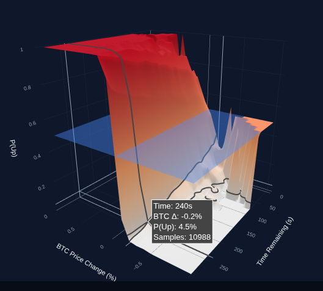
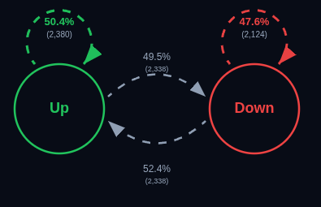

# NegativeEV - Milestone 2

## Project Goal

The goal of our project is to build an interactive visualization of Polymarket’s Bitcoin 5-minute prediction markets in order to study how well market prices reflect the true probability of the outcome. Our MVP focuses on showing how implied probabilities evolve during each round and whether these probabilities are actually calibrated against the realized Bitcoin price movement. More broadly, we want to make this new type of ultra-short-term prediction market understandable and explorable through data visualization.

Our project aims to:

- show how prediction market prices change over the 5-minute lifetime of a market,
- compare market-implied probabilities with the actual observed frequency of outcomes,
- highlight where the market seems well calibrated and where it appears biased or inefficient,
- help users explore the effect of factors such as time remaining, volatility, and BTC price movement,
- provide an intuitive visual tool for understanding market behavior in a high-frequency setting.

This is interesting because prediction markets are usually studied over long horizons such as elections or sports, while here we test them at the scale of only a few minutes. This makes the project both original and valuable, since it can reveal whether the “wisdom of crowds” still holds in an extremely fast and noisy environment.

## Visalizations

### 1. Calibration surface

What: An interactive 3D surface showing the historical probability of an Up outcome as a function of time remaining and BTC price change during the 5-minute round. A second semi-transparent surface/plane will represent the market-implied probability from the token price.

How: We bin the data by time and price variation, then compute the observed win rate of the Up outcome in each bin. Users can rotate, zoom, and hover to inspect specific regions.

Why: This visualization is the core of the project, since it directly shows where the market is well calibrated and where it seems to over- or under-estimate the true probability.

#### Tools:

- 
- 

### 2. Outcome transition diagram

What: A transition diagram based on a simple Markov-chain view of the sequence of market outcomes (Up / Down), showing how often one result is followed by another.

How: We compute transition probabilities from the ordered sequence of resolved markets and display them as arrows between states, with labels or edge sizes encoding the probabilities.

Why: This helps us check whether consecutive outcomes behave independently or whether short streaks, persistence, or reversals appear in the data.

#### Tools:
- 
- 

## RoadMap for the core website

### TODO (todo list)

### Additional ideas

### Notes And Additonal Information

