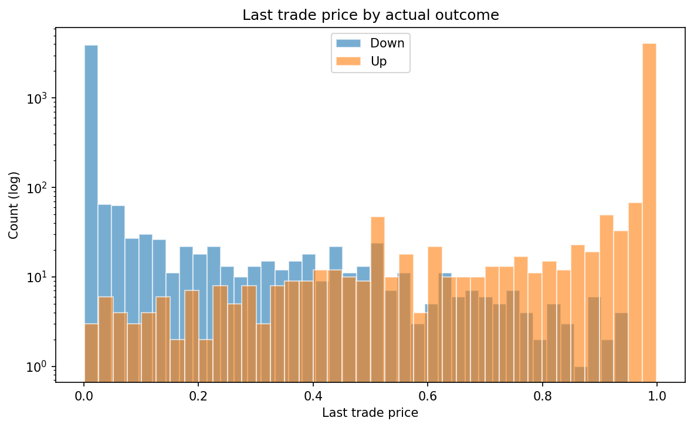
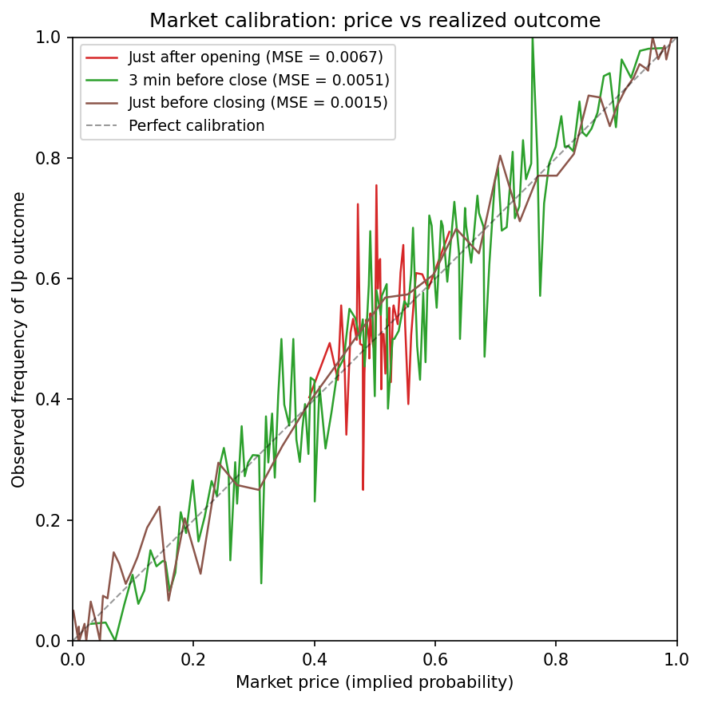

# Project of Data Visualization (COM-480)

| Student's name | SCIPER |
| -------------- | ------ |
| Anton Svet | 347212 |
| Santiago Rivadeneira | 339832 |
| Arthur Margeat | 330258 |

[Milestone 1](#milestone-1) • [Milestone 2](#milestone-2) • [Milestone 3](#milestone-3)

## Milestone 1 (20th March, 5pm)

**10% of the final grade**

This is a preliminary milestone to let you set up goals for your final project and assess the feasibility of your ideas.
Please, fill the following sections about your project.

*(max. 2000 characters per section)*

### Dataset

Our project relies on a custom dataset combining **[Polymarket’s Bitcoin 5-minute](https://polymarket.com/crypto/5M)** prediction markets with **[Binance](https://www.binance.com/en/price/bitcoin)** Bitcoin price data. Since no ready-made dataset exists for this market type, we constructed it by querying [Polymarket API](https://docs.polymarket.com/api-reference/introduction) endpoints to collect market metadata, outcomes, and trade sequences, and matched it with Binance spot BTC prices.

In these markets, users bet on whether the price of Bitcoin will be higher after 5 minutes relative to the opening price. Each market offers two tokens: **YES** (price goes up) and **NO** (price does not go up). Users can buy and sell tokens continuously during the **5-minute window**, and their prices reflect the market-implied probability of each outcome. At resolution, the winning token pays **1 USDC**, while the other becomes worthless.

This format was introduced in **mid-December 2025**, with consistent activity starting in early **February 2026**. Each market lasts **5 minutes (288 per day)**, and our dataset contains **9,000+** events, forming a unique high-frequency financial dataset.

The data is of high quality: outcomes are clearly defined and timestamps are precise, allowing us to track how implied probabilities evolve during each event. Preprocessing includes aligning trades with Binance prices, removing anomalous rounds, and computing variables such as time remaining and price change. Due to API limitations, we only retain transactions involving **≥10 tokens**, filtering out negligible trades while preserving most meaningful activity.

(The dataset will be made publicly available at a later stage, e.g., via **Hugging Face** or a similar platform.)

*Note: Polymarket is not directly accessible from Switzerland, and access may require the use of a VPN connection.*
### Problematic

Prediction markets have emerged as powerful forecasting tools. In the 2024 US elections, Polymarket correctly called 49 of 50 states, outperforming every major polling aggregator. The theoretical foundation, the "wisdom of crowds", posits that when participants stake real capital, market prices converge to true event probabilities.

But does this hold at micro-durations? Polymarket's Bitcoin 5-minute markets (btc-updown-5m) create a new market every 5 minutes: users bet whether BTC will go up or down relative to the opening price. With ~288 markets daily and thousands resolved since early February 2026, we have an unprecedented dataset to test calibration at ultra-short timescales.

Our central question: **when a token trades at 70 cents (implying 70% probability), does the predicted outcome actually occur 70% of the time?** We investigate how this calibration varies across time remaining, price momentum, and volatility.

The core visualization is an interactive 3D surface comparing market-implied probability vs. historical outcome frequency. Axes: time remaining (0–300s), BTC price variation (%), and probability. Users can rotate, zoom, and overlay surfaces to spot where the market systematically over- or under-estimates outcomes.

Target audience: traders seeking pricing inefficiencies, researchers in market microstructure, data scientists benchmarking prediction models, and anyone interested in behavioral finance. Evidence suggests systematic biases in short-term markets: favorite-longshot bias, bot dominance (95%+ of trades), and last-second volatility spikes. Our tool makes these patterns visually explorable.

### Exploratory Data Analysis

We built a custom dataset by querying Polymarket's API and matching trades with Binance BTC spot prices. Our pipeline ([`build_dataset.py`](scripts/build_dataset.py)) produces two outputs: a **summary CSV** (1 row per market, 27 features) and a **timeseries Parquet** (1 row per market per second, 300 rows/market) containing the implied probability and BTC price at each second. The dataset spans **Feb 12 - Mar 15, 2026**. Full EDA notebook: [`eda_btc5m.ipynb`](notebooks/eda_btc5m.ipynb).

| Metric | Value |
|---|---|
| Markets | 9,181 |
| Total volume | $686 M |
| Median volume / market | $80,522 |
| Total trades | 16.8 M |
| Avg trades / market | 1,835 |
| Up rate | 51.4% (4,719 Up / 4,462 Down) |
| Median bid-ask spread | 1 cent |

**Last trade price by outcome** - This histogram (log scale) shows the distribution of the last Up token price before market resolution, split by actual outcome. In the vast majority of cases the token is worth 0 or 1 just before the close, since uncertainty is virtually zero at that point. The remaining values are mostly noise, except for a notable spike at 0.5, which corresponds to the rare markets where BTC experienced a very large price swing and doubt persisted until the very last second.

**Market calibration: price vs realized outcome** - Using our per-second timeseries, we compare the market's implied probability (token price) to the actual observed frequency of Up outcomes at three time horizons. The diagonal represents perfect calibration. Just after opening, the curve is nearly flat around 0.5 - the market has no predictive power yet. By 3 minutes before close, calibration improves significantly. Just before closing, the curve hugs the diagonal almost perfectly, showing the market accurately prices outcomes as it approaches resolution.

### Related work

**Existing work:** [Brier.fyi](https://brier.fyi/charts/polymarket/) analyzes 98,000+ Polymarket markets with 2D calibration curves, but focuses on long-duration markets with static plots. [Polymarket Analytics](https://www.polymarketanalytics.com/) and [Dune](https://dune.com/rchen8/polymarket) track on-chain activity but lack calibration analysis. [Tsang & Yang (2026)](https://arxiv.org/abs/2603.03136) study Polymarket's 2024 election microstructure; [Becker (2026)](https://jbecker.dev/research/prediction-market-microstructure) documents wealth transfer from takers to makers and an "Optimism Tax."

**Originality:** No prior work combines (1) 3D surface visualization, (2) ultra-short-term prediction markets (5 min), and (3) calibration comparing token prices to actual outcome frequencies. The closest analogy is the implied volatility surface from options finance: we adapt (strike x expiry x IV) to (token price x time remaining x real probability). Our dataset (btc-updown-5m, since Feb 2026) has not been studied in any published work.

**Visual inspiration:** [NYT Election Needle](https://www.nytimes.com/interactive/2024/11/05/us/elections/results-president-forecast-needle.html) for probability under uncertainty. [FiveThirtyEight](https://projects.fivethirtyeight.com/) forecast models. [The Pudding](https://pudding.cool/) for scrollytelling. [Plotly.js](https://plotly.com/javascript/3d-surface-plots/) and [d3-x3d](https://jamesleesaunders.github.io/d3-x3d/) for 3D surfaces. Past COM-480 projects: [Lausanne Transportation 2023](https://github.com/com-480-data-visualization/project-2023-the-vizards), [Formula 1 2024](https://github.com/com-480-data-visualization/project-2024-Formula1).

**No prior exploration:** This dataset has not been used in any other course or project by our team.

## Milestone 2 (17th April, 5pm)

**10% of the final grade**

## Milestone 3 (29th May, 5pm)

**80% of the final grade**

## Late policy

- < 24h: 80% of the grade for the milestone
- < 48h: 70% of the grade for the milestone

