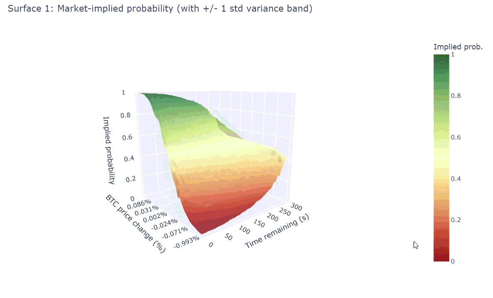

# NegativeEV

**Do Polymarket's 5-minute Bitcoin prediction markets really predict?**

[](https://negative-ev.vercel.app)

COM-480 Data Visualization · EPFL · Spring 2026

| Student | SCIPER |
|---|---|
| Anton Svet | 347212 |
| Santiago Rivadeneira | 339832 |
| Arthur Margeat | 330258 |

<p align="center">
  <a href="https://negative-ev.vercel.app">
    
  </a>
</p>

---

## The question

In late 2025, Polymarket launched [`btc-updown-5m`](https://polymarket.com/crypto/5M): a family of prediction markets where a new round opens every five minutes and traders bet whether BTC will close *Up* or *Down* relative to the opening price. With ~288 rounds per day and 9,181 resolved markets in our window, this is a natural experiment on crowd calibration at sub-minute granularity, two orders of magnitude faster than any market traditionally studied in the calibration literature.

The project name, *NegativeEV*, is a nod to the trading term *negative expected value*: the outcomes we expect to find when calibration breaks down.

We ask one focused question:

> **When the market implies an X % probability of Up, does Up actually occur X % of the time?**

We answer it visually, comparing observed outcome frequencies against market-implied probabilities along the two dimensions that should drive them: *time remaining* inside the round, and *BTC price momentum* since round open.

The full project narrative, design rationale and evidence are on the live site: **https://negative-ev.vercel.app**.

## Dataset at a glance

| Metric | Value |
|---|---|
| Resolved markets | 9,181 |
| Total volume | $686 M |
| Total trades | 16.8 M |
| Avg trades / market | 1,835 |
| Up rate | 51.4 % (4,719 Up / 4,462 Down) |
| Median bid-ask spread | 1 cent |
| Window | Feb 12 - Mar 15, 2026 (32 days) |

Built from scratch by querying the [Polymarket API](https://docs.polymarket.com/api-reference/introduction) and matching trades against [Binance](https://www.binance.com/en/price/bitcoin) BTC spot prices. Full dataset documentation in [docs/dataset.md](docs/dataset.md); full EDA in [notebooks/eda_btc5m.ipynb](notebooks/eda_btc5m.ipynb).

## The narrative on the live site

The site is a single scrollable page that walks the reader through the calibration question step by step. Sections, in reading order ([website/src/App.tsx](website/src/App.tsx)):

1. **Hero** — animated outcome split and dataset counters.
2. **Intro** — what these markets are and why 5 minutes is hard.
3. **Calibration surface** — the centrepiece. Interactive 3D ECharts GL surface of `P(Up | BTC Δ, time remaining)` versus the 50 % reference plane.
4. **Statistics** — dataset shape: BTC Δ histogram, daily volume, trades-per-market.
5. **Temporal** — day-of-week × hour heatmaps (volume and Up rate).
6. **Distributions** — fat-tail behaviour of price moves and the volume-vs-Δ scatter.
7. **Markov** — empirical transition matrix on the ordered sequence of 9,181 outcomes, with an animated 20-step random walk and a streak-length histogram.
8. **Calibration over time** — 2D companion that reads the surface back as calibration curves at four moments before close.
9. **Verdict** — synthesis of the findings and an off-baseline / calibrated framing.
10. **Playground** — a backtest in 50 sequential live markets with $100 of virtual capital, fed by the empirical calibration lookup.

Per-section design rationale (encoding choices, interactions, rejected alternatives) lives in [docs/visualizations.md](docs/visualizations.md).

## Repository layout

```
.
├── README.md                       # this file
├── requirements.txt                # Python deps for the data pipeline
├── data/processed/                 # cleaned dataset (parquet + csv)
├── notebooks/                      # EDA + 3D-surface exploration
├── scripts/                        # ETL + plot generators (Python)
├── docs/                           # docs (this README's siblings) + plot assets
│   ├── dataset.md                  # dataset construction + schema
│   ├── visualizations.md           # per-section design rationale
│   ├── pipeline.md                 # full reproduction guide
│   ├── related_work.md             # prior art, papers, visual inspiration
│   ├── images/, videos/            # static assets used by the docs
│   └── up_cumulative_echarts3d.html# pre-rendered 3D surface (iframed by the site)
└── website/                        # React 19 + Vite + Tailwind 4 SPA
    ├── public/data/*.json          # JSON shipped to the client
    └── src/components/sections/    # the 10 narrative sections
```

## Quickstart

### Run the website locally

```bash
cd website
npm install
npm run dev
```

The dev server (default `http://localhost:5173`) serves `docs/*.html` under `/plots/` so the iframe in the calibration section loads `docs/up_cumulative_echarts3d.html` directly. See [website/README.md](website/README.md) for production build details.

### Regenerate the data and plots

```bash
pip install -r requirements.txt

python scripts/build_cumulative_surface_html.py --sigma-y 0 --sigma-t 3.0
python scripts/build_analysis_data.py
python scripts/export_calibration_lookup.py
python scripts/export_playground_events.py
```

Full reproduction guide — every script, every flag, every output path, plus the spot-check values used to validate the surface — is in [docs/pipeline.md](docs/pipeline.md).

## Tech stack

| Concern | Tool | Notes |
|---|---|---|
| 3D calibration surface | [Apache ECharts GL](https://github.com/ecomfe/echarts-gl) | Pre-rendered offline as a self-contained HTML, iframed at `/plots/`. Plotly.js was prototyped but produced visible triangulation fins on the directional probability surface. |
| 2D charts (histograms, scatters, area, heatmaps) | Hand-coded React + SVG | Recharts was prototyped early; rolling our own SVG gave us pixel-perfect axes, log-scale ticks, and a single shared theme. |
| Markov diagram | Hand-coded React + SVG | Two-state topology doesn't benefit from a force layout. |
| Narrative shell | React 19 + Vite + Tailwind CSS 4 | Pure SPA with scroll-spy; no scrollytelling library needed at this length. |
| Data pipeline | Python (pandas, numpy, scipy, pyarrow) | Crunches ~15 GB of raw JSON into ~6 MB of tabular and JSON assets. |

## Documentation

| Doc | Topic |
|---|---|
| [docs/dataset.md](docs/dataset.md) | Source, window, schema of the parquet and CSV, EDA reference renders. |
| [docs/visualizations.md](docs/visualizations.md) | Per-section design rationale: encoding, interactions, tools chosen vs rejected. |
| [docs/pipeline.md](docs/pipeline.md) | Full pipeline reproduction guide (every script, every flag). |
| [docs/related_work.md](docs/related_work.md) | Prior art, academic references, visual inspiration. |
| [website/README.md](website/README.md) | Frontend developer notes (npm scripts, data assets). |

## Methodology disclosure (AI-assisted tools)

Two distinct phases used AI assistants. The data-cleaning pipeline (~15 GB raw JSON to ~6 MB tabular and JSON) was developed iteratively with Cursor + Claude Code, with all code reviewed and run locally. The first React + Tailwind frontend was bootstrapped with Lovable as a design-exploration tool to lock the information architecture and visual identity; the live site at https://negative-ev.vercel.app is the hand-authored rewrite that replaced it.

## References and acknowledgements

- Prior calibration dashboards, microstructure papers and visual inspiration: [docs/related_work.md](docs/related_work.md).
- Course: [COM-480 Data Visualization](https://com-480-data-visualization.github.io/), EPFL, Spring 2026.
- Past COM-480 projects we drew inspiration from: [Lausanne Transportation 2023](https://github.com/com-480-data-visualization/project-2023-the-vizards), [Formula 1 2024](https://github.com/com-480-data-visualization/project-2024-Formula1).
