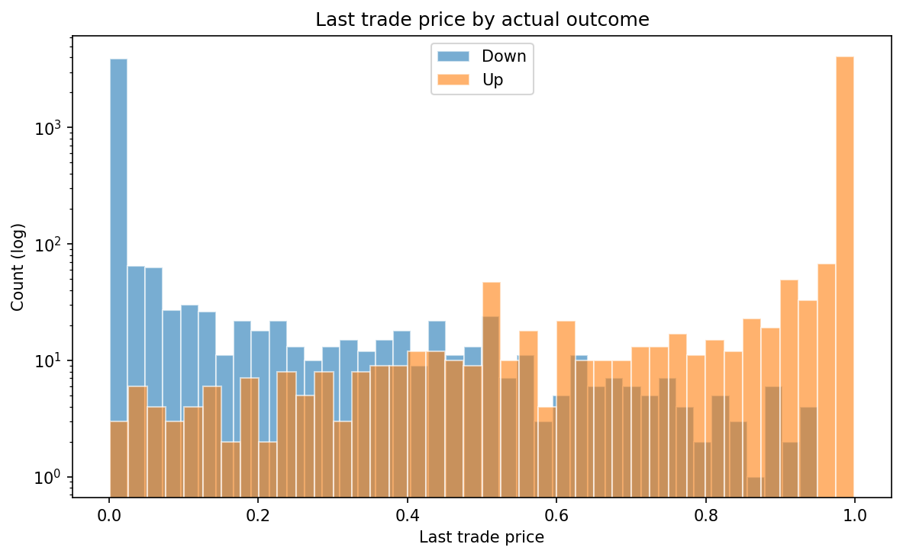
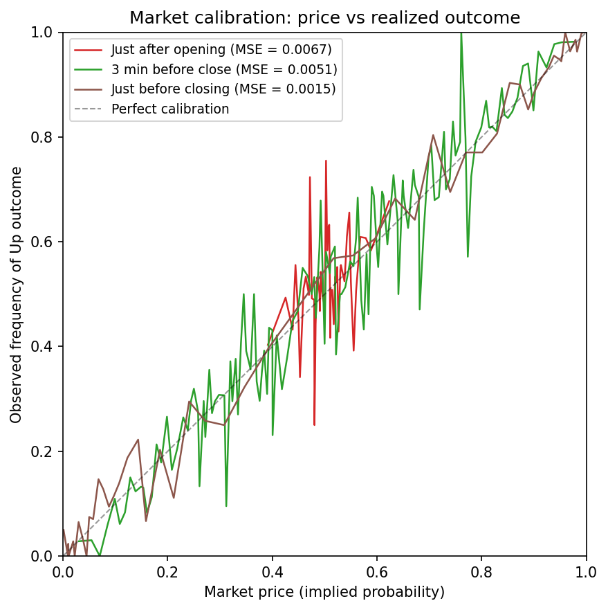

# Dataset

[← Back to README](../README.md)

The NegativeEV dataset combines [Polymarket's `btc-updown-5m`](https://polymarket.com/crypto/5M) prediction markets with [Binance](https://www.binance.com/en/price/bitcoin) BTC spot prices. No ready-made dataset exists for this market type; we built it ourselves by querying [the Polymarket API](https://docs.polymarket.com/api-reference/introduction) for market metadata, outcomes and trade sequences and matching them against second-by-second Binance BTC/USD prices.

## What is a `btc-updown-5m` market?

Every five minutes, Polymarket opens a new round. Traders bet on whether the BTC price will be higher after 5 minutes than at the round's open. Each market offers two tokens: **Up** (price goes up) and **Down** (price does not go up). Tokens trade continuously inside the 5-minute window, and their prices reflect the market-implied probability of each outcome. At resolution, the winning token pays 1 USDC, the other becomes worthless.

The format launched in mid-December 2025 with consistent activity from early February 2026. ~288 markets per day, 5 minutes each.

> *Note:* Polymarket is not directly accessible from Switzerland; access may require a VPN.

## Window and headline numbers

| Metric | Value |
|---|---|
| Resolved markets | 9,181 |
| Total volume | $686 M |
| Median volume / market | $80,522 |
| Total trades | 16.8 M |
| Avg trades / market | 1,835 |
| Up rate | 51.4 % (4,719 Up / 4,462 Down) |
| Median bid-ask spread | 1 cent |
| Time window | Feb 12 - Mar 15, 2026 (32 days) |

Live values rendered on the homepage are read from [website/public/data/hero_stats.json](../website/public/data/hero_stats.json).

## Files

| Path | Granularity | Contents |
|---|---|---|
| [`data/processed/btc_5m_timeseries.parquet`](../data/processed/btc_5m_timeseries.parquet) | 1 row per (market, second) | ~9,181 markets × 300 seconds. The main file used by every plot generator. |
| [`data/processed/btc_5m_full.csv`](../data/processed/btc_5m_full.csv) | 1 row per market | 27 summary features per round (resolution, volume, BTC OHLC, volatility, trade-level aggregates). |

### Parquet schema (`btc_5m_timeseries.parquet`)

| Column | Type | Description |
|---|---|---|
| `event_timestamp` | int64 | Round-open Unix timestamp (UTC). Joins to the CSV row. |
| `second` | int32 | Seconds since round open (0 … 299). |
| `implied_prob` | float64 | Market-implied P(Up) at this second, derived from the most recent trade price (Up trade ⇒ price; Down trade ⇒ 1 − price). |
| `btc_price` | float64 | Binance BTC/USD spot price at this second. |
| `btc_pct_change` | float64 | `(btc_price − btc_open) / btc_open` since round open. |
| `winner_binary` | int8 | 1 if the round resolved Up, 0 if Down. Constant within a round. |

### CSV summary features (`btc_5m_full.csv`)

`slug`, `event_timestamp`, `event_datetime`, `date`, `hour`, `minute`, `day_of_week`, `winner`, `winner_binary`, `volume`, `last_trade_price`, `best_bid`, `best_ask`, `spread`, `closed`, `btc_open`, `btc_close`, `btc_high`, `btc_low`, `btc_return`, `btc_volatility`, `btc_range`, `n_trades`, `n_unique_traders`, `total_trade_size`, `avg_trade_price`, `up_buy_pct`.

See [scripts/build_dataset.py](../scripts/build_dataset.py) for exact derivations.

## Preprocessing notes

- **Trade filter.** Due to API limitations we keep only transactions of ≥10 tokens, dropping negligible noise while preserving the bulk of meaningful activity.
- **Tie handling.** Six rounds where `btc_open == btc_close` exactly are dropped from the analysis JSONs, leaving 9,175 markets used by the website (the surface still uses the full 9,181 with the standard outcome convention).
- **Outcome source.** For the trading playground and Block B / C analyses we classify Up/Down from the actual first-vs-last BTC price, not `winner_binary`, so a user replaying a market sees the same outcome the chart shows.

## EDA reference renders

**Last trade price by outcome.** Histogram (log scale) of the last Up token price before market resolution, split by actual outcome. In the vast majority of cases the token is at 0 or 1 just before close. The remaining values are noise except for a notable spike at 0.5, corresponding to the rare markets where BTC experienced a large late swing and doubt persisted to the final second.

**Market calibration: price vs realized outcome.** Using the per-second timeseries we compare the market's implied probability (token price) against the observed frequency of Up at three time horizons. The diagonal is perfect calibration. Just after opening the curve is flat near 0.5: the market has no predictive power yet. By 3 minutes before close calibration improves significantly. Just before closing the curve hugs the diagonal almost perfectly.

Full exploratory notebook: [notebooks/eda_btc5m.ipynb](../notebooks/eda_btc5m.ipynb).

## How the dataset was built

1. [`scripts/fetch_btc5m.py`](../scripts/fetch_btc5m.py) — pulls market metadata, trades and Binance price ticks for each round.
2. [`scripts/build_dataset.py`](../scripts/build_dataset.py) — produces the CSV and parquet listed above.
3. Downstream JSONs for the website are produced by [`scripts/build_analysis_data.py`](../scripts/build_analysis_data.py), [`scripts/export_calibration_lookup.py`](../scripts/export_calibration_lookup.py) and [`scripts/export_playground_events.py`](../scripts/export_playground_events.py).

The full reproduction guide (every flag, every output path, validation spot-checks) is in [docs/pipeline.md](pipeline.md).

## Future availability

We plan to publish the cleaned dataset on Hugging Face (or a comparable platform) once the academic submission window closes.
