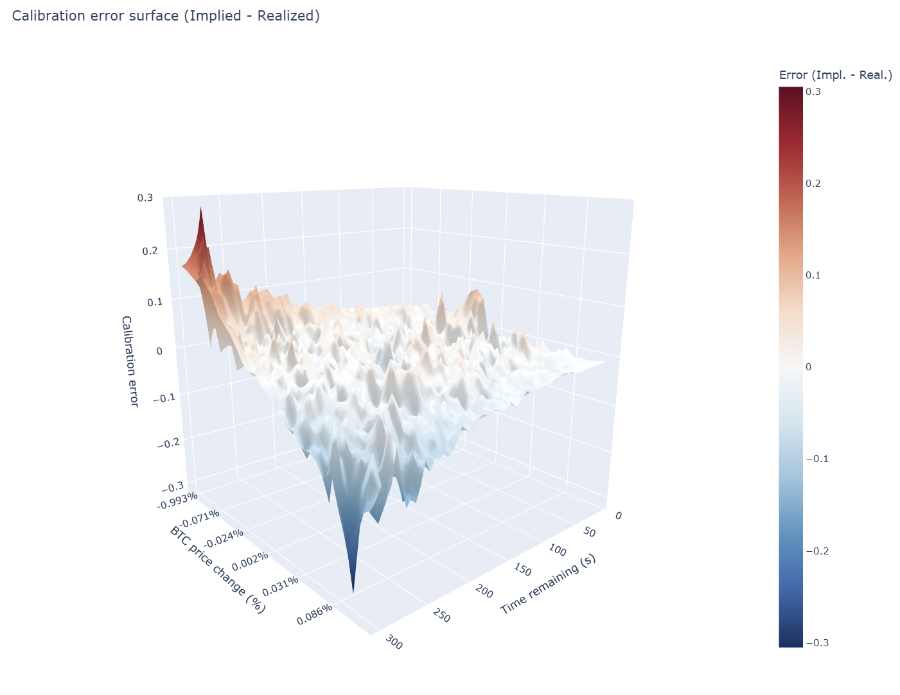

# Visualizations

[← Back to README](../README.md)

The site ([https://negative-ev.vercel.app](https://negative-ev.vercel.app)) is a single scrollable narrative. This document is the design rationale for every section: what it shows, why it is there in the reading order, how the data is encoded, what interactions it offers, and what we built it with.

## Reading order at a glance

1. [Hero](#hero) — outcome split + dataset counters.
2. [Intro](#intro) — three definition cards (silent connector).
3. [Calibration surface](#calibration-surface) — headline visualisation.
4. [Statistics — Rewind 1/4](#statistics--rewind-14) — is the dataset trustworthy?
5. [Temporal — Rewind 2/4](#temporal--rewind-24) — does time of day matter?
6. [Distributions — Rewind 3/4](#distributions--rewind-34) — what kind of moves are priced?
7. [Markov — Rewind 4/4](#markov--rewind-44) — does the previous round predict the next?
8. [Calibration over time](#calibration-over-time) — closing 2D companion that reads the surface back.
9. [Verdict](#verdict) — synthesis (silent connector).
10. [Playground](#playground) — your turn.

The Calibration surface deliberately *describes* itself rather than concluding. The four "rewind" sections that follow prune every easy alternative explanation (sample size, time-of-day bias, return shape, streak persistence). Only after that does the Calibration-over-time section read the surface back as 2D curves and earn the right to a Verdict.

---

## Hero

**What.** Title, one-line problem statement, animated outcome gauge (Up vs Down split across all 9,181 markets), three counter cards (markets, total volume, days), and a date-range pill. All numeric content is read live from [`website/public/data/hero_stats.json`](../website/public/data/hero_stats.json), so the page stays in sync with whatever the pipeline last produced.

**Why first.** Anchors dataset scale before any interactive element competes for attention.

**Encoding.** Text marks; typographic weight, the rise-from-zero animation, and the gauge's bidirectional fill carry the signal.

**Tools.** React 19 + Tailwind, custom `useAnimatedCounter` hook on `requestAnimationFrame` with cubic ease-out.

---

## Intro

**What.** Three definition cards: *what is a prediction market*, *why 5-min BTC*, *what does "right" mean*. Bridges the gap for readers with no Polymarket exposure.

**Why here.** Pure setup. Carries the `id="intro"` chevron target only; it is not in the nav, on purpose, so the scroll-spy stays anchored on chart-bearing sections.

**Encoding.** Text only.

---

## Calibration surface

**What.** A rotatable 3D surface plotting `P(Up | BTC Δ since open, time remaining)` against the 50 % reference plane. Each cell on the surface holds the empirical Up rate among the markets that, at that instant, had BTC at least Y % away from their opening price. Y ≥ 0 reads as "BTC up by at least Y %"; Y < 0 reads as "BTC down by at least |Y| %".

**Why centrepiece.** Answers the calibration question in a single image. Adapts the implied volatility surface from options finance, substituting `(strike, expiry, IV)` with `(BTC Δ, time remaining, empirical P(Up))`.

**Encoding.** Position on three axes for the three variables; colour on a diverging RdYlGn palette for the calibration error (empirical minus 0.5), *not* the probability itself. A diverging palette on probability would wrongly imply 1 is "good" and 0 is "bad"; both are equally informative outcomes. The 50 % reference plane is rendered semi-transparent for readable overlap.

**Interactions.** Drag rotates, scroll zooms, hover surfaces a `(time, Δ, P(Up), sample count)` tooltip. The plot is a static, self-contained ECharts GL HTML served from [`docs/up_cumulative_echarts3d.html`](up_cumulative_echarts3d.html) and embedded via an iframe at `/plots/up_cumulative_echarts3d.html` (see [website/vite.config.ts](../website/vite.config.ts)).

**Tools.**

| Choice | Reason |
|---|---|
| **Chosen:** Apache ECharts GL, pre-rendered offline | Self-contained, no client aggregation, no triangulation fins. |
| Rejected: Plotly.js / `react-plotly.js` | Visible fins on directional probability surfaces along the Y = 0 boundary; default colourbar/axes hard to override. |
| Rejected: Three.js / R3F | Would force custom shaders, axes, and colourbar from scratch. |

**Pipeline.** [`scripts/build_cumulative_surface_html.py`](../scripts/build_cumulative_surface_html.py) computes the surface and writes the standalone HTML. Smoothing must be `--sigma-y 0` because Y-direction smoothing crosses the Y = 0 boundary and mixes incompatible left- vs right-tail counts; full rationale and validated spot-checks in [pipeline.md](pipeline.md#1-scriptsbuild_cumulative_surface_htmlpy).

---

## Statistics — Rewind 1/4

**What.** Three sanity checks on the dataset itself, top to bottom: *daily volume* (32 days, no gaps, scaled in late February and peaked in early March), *trades per market* (the ~98 % of rounds that clear 500+ trades), and *fat-tail BTC return distribution* (±3 % view with a Gaussian fit that visibly undershoots the tails).

**Why.** Before reading anything into the surface, prove the dataset is dense enough to ask the question.

**Encoding.** Position (x-axis) for binned quantitative dimensions, length (bar height) for counts, ordered hue for Up/Down where applicable. The Gaussian fit is overlaid as a thin curve so the leptokurtic gap is visible, not asserted.

**Interactions.** Hover for tick-level detail; charts are responsive and re-bin on resize.

**Tools.** Hand-coded React + SVG. Recharts was prototyped early and dropped: rolling our own gave us pixel-perfect axes, log-scale ticks, and a single shared theme. See [website/src/components/charts/](../website/src/components/charts/).

---

## Temporal — Rewind 2/4

**What.** Two day-of-week × hour heatmaps on the same 7 × 24 grid: traded volume first, then Up rate. Lets the reader visually check whether activity peaks coincide with any outcome bias.

**Why.** Rules out the most plausible "easy" edge before the surface is interpreted: time of day.

**Encoding.** Sequential `viridis` for volume (ordered quantitative). Diverging RdYlGn (green > 50 %, red < 50 %) for Up rate, deliberately reusing the same palette as the calibration surface for cross-section consistency.

**Interactions.** Hover surfaces the cell's exact value and underlying market count.

**Tools.** Custom React + SVG heatmap (`HeatmapChart`); pixel-perfect axis labels. Rejected alternatives: Recharts Treemap (no tick-aligned labels), generic d3-heatmap (too low-level for a single-component need).

---

## Distributions — Rewind 3/4

**What.** Two charts side by side. *Final BTC Δ distribution by outcome:* histogram (60 bins, ±0.55 % clip) stacked by Up/Down with a normal-fit overlay. *Volume vs final BTC change:* scatter on log-Y, downsampled to 2,000 points from 9,181 for 60 fps.

**Why.** Explains why prices cluster near 50 % (most rounds end nearly flat) and why volume tracks *uncertainty*, not direction (volume peaks at ΔBTC ≈ 0).

**Encoding.** Position (x-axis) for ΔBTC, length for histogram counts, ordered hue for Up/Down. Log-Y scatter to compress the long volume tail without losing low-volume markets.

**Interactions.** Hover for tick-level details. Brush highlight on the scatter (preserves the ±3 % wider view used by `WideDistributionChart`).

**Tools.** Hand-coded SVG (`BtcDistributionChart`, `VolumeVsChangeScatter`).

---

## Markov — Rewind 4/4

**What.** Two state circles (Up, Down) and four directed edges carrying the empirical transition probabilities computed from the ordered sequence of 9,181 resolutions. A *Simulate* button fires a 20-step random walk that highlights each traversed edge in real time. A companion bar chart shows the streak-length distribution against the geometric reference.

**Why.** Tests whether consecutive outcomes are truly independent or whether short streaks, persistence or reversals hide in the data. The animated walk makes the abstract transition matrix tangible for non-quants.

**Encoding.** Node size encodes marginal frequency; edge width encodes transition probability (redundant with the numeric label for robustness); highlight colour during simulation. The streak chart uses grouped bars, one colour per direction.

**Interactions.** Hover an edge dims the others; speed slider (100 to 1000 ms per step); a single-click *Simulate* button drives a 20-step walk.

**Tools.** Hand-coded SVG + React state for the diagram (two-state topology doesn't benefit from a force layout). Same SVG primitives for the streak histogram. See [website/src/components/MarkovDiagram.tsx](../website/src/components/MarkovDiagram.tsx).

---

## Calibration over time

**What.** The headline surface read back as 2D calibration curves at four moments before close (e.g. T − 5 min, T − 3 min, T − 1 min, T − 5 s). Markets are binned by their live implied Up probability and the realised Up rate is plotted per bucket, alongside the per-curve MSE.

**Why.** Quantifies what the surface was pointing at: the curves collapse onto the diagonal as time runs out, and MSE shrinks by an order of magnitude (from ≈ 0.003 at open to ≈ 0.0003 just before close).

**Encoding.** Position for predicted vs realised, dashed diagonal for the perfect-calibration reference, single hue per time horizon, sample count and MSE shown next to each curve.

**Interactions.** Hover surfaces the bin's count and exact (predicted, realised). Curves animate in on scroll-into-view.

**Tools.** Hand-coded SVG (`CalibrationCurvesChart`). Data: [`website/public/data/calibration_curves.json`](../website/public/data/calibration_curves.json).

---

## Verdict

**What.** Four short paragraphs in a single accent-bordered card: the headline answer (mostly yes, depends on round state); the time-remaining mechanism (10× MSE drop from open to close); the two patterns that survive (≈ 2× MAE for `|ΔBTC| > 10 %`; persistent ~1 pp under-pricing of Up); and the one-line hand-off to the playground.

**Why.** Synthesis. Numbers in the prose come from the live data files and are cross-checked by [`scripts/verify_verdict_numbers.py`](../scripts/verify_verdict_numbers.py).

**Encoding.** Text only with hue accents on the verdict and the two numeric headlines.

---

## Playground

**What.** Replays real Polymarket BTC 5-minute markets back-to-back with $100 of virtual capital. Each round, the BTC chart and live token prices update tick by tick; the user buys or sells Up / Down at any point and the winning side cashes out at close.

**Why.** Hands the findings back to the reader. The *Full* mode adds a *Historical Prediction Insight* panel that runs the calibration math on every tick, fed by the empirical lookup table, and flags *where* history disagrees with the live price (not when or how much to bet).

**Encoding.** Live BTC line + token-price area chart on the same time axis, Up / Down buy buttons styled in green / red with directional arrows, PnL strip per round, session summary modal at the end.

**Interactions.** Speed control (1× / 4× / 16×), pause, click-to-buy / click-to-sell, calibration verdict thresholds tunable in the *Verdict tuning* panel, session length and difficulty configurable up front.

**Tools.** Pure React state machine (`reducer.ts`, `types.ts`), hand-coded SVG for the chart. Data: [`website/public/data/playground_events.json`](../website/public/data/playground_events.json) (50 sequential markets, 300 s each) and [`website/public/data/calibration_lookup.json`](../website/public/data/calibration_lookup.json) (P(Up | T, ΔBTC) lookup).

---

## Visual identity

**Theme.** Dark (`#0f172a`) to match trading-platform convention and let chromatic data pop. Up = green (`#22c55e`), Down = red (`#ef4444`), calibration error on diverging RdYlGn, volume on sequential viridis, interaction accent in blue / purple (`#3b82f6` / `#c084fc`).

**Typography.** Inter (body), JetBrains Mono (numbers and code).

**Accessibility.** Red / green pairs use directional arrows (▲ / ▼) for colour-blind safety, every chart carries an `aria-label`, `prefers-reduced-motion` disables auto-rotation and step animations, heatmaps collapse to a single column on mobile.

**Performance.** The scatter is downsampled to 2,000 points for 60 fps. The 3D surface ships as a self-contained ECharts HTML, so the client never aggregates 16.8 M trades.

## Tool stack at a glance

| Need | Chosen | Rejected (why) |
|---|---|---|
| 3D surface | Apache ECharts GL, pre-rendered HTML | Plotly.js (triangulation fins on Y = 0); Three.js / R3F (custom shaders, axes, colourbar from scratch) |
| 2D charts | Hand-coded React + SVG | Recharts (no pixel-perfect log ticks at this scale); Visx (more boilerplate for the same result) |
| Heatmaps | Custom React + SVG (`HeatmapChart`) | Recharts Treemap (no axis-aligned labels) |
| Markov diagram | Hand-coded SVG + React state | D3 force-layout (fixed 2-state topology) |
| Narrative shell | React 19 + Vite + Tailwind 4 | Next.js (overkill for a static SPA); GSAP ScrollTrigger (Scrollama-style fade-in is enough at this length) |
| Data pipeline | Python (pandas, numpy, scipy, pyarrow) | DuckDB-only pipeline (less leverage on the smoothing math) |

## Cross-references

- Per-script reproduction guide: [docs/pipeline.md](pipeline.md).
- Dataset schema and EDA stills: [docs/dataset.md](dataset.md).
- Prior art and visual inspiration: [docs/related_work.md](related_work.md).
