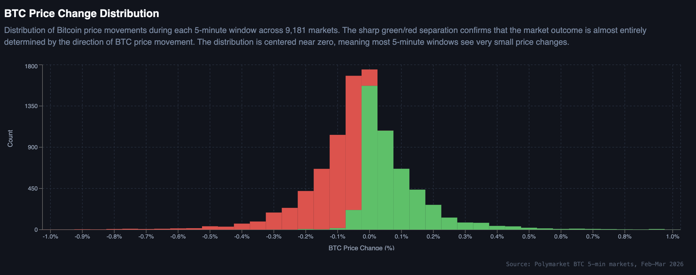
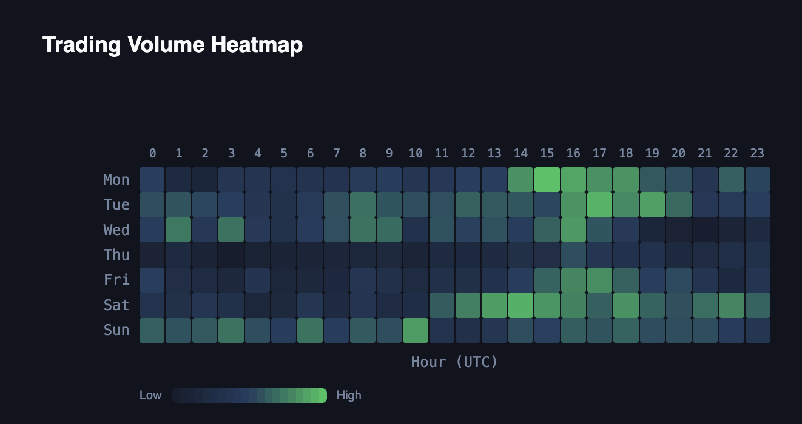
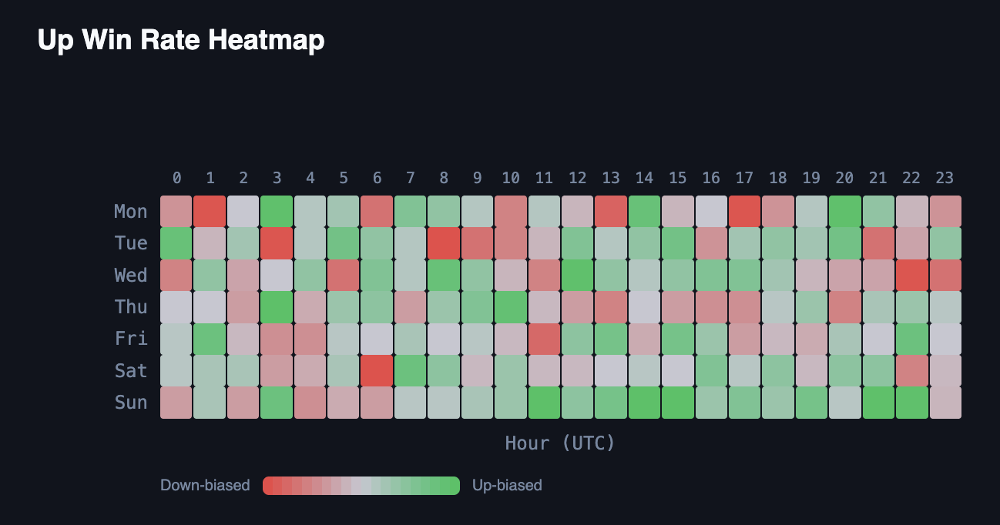

# NegativeEV
**Are Polymarket's 5-minute Bitcoin markets actually well-calibrated?**

COM-480 Data Visualization · EPFL Spring 2026 · Milestone 2

Anton Svet (347212) · Santiago Rivadeneira (339832) · Arthur Margeat (330258)

Prototype: https://negativeev.lovable.app/
Repository: https://github.com/com-480-data-visualization/NegativeEV

## 1. Project goal

In late 2025 Polymarket launched `btc-updown-5m`, a family of prediction markets where a new round opens every five minutes. Traders bet whether BTC will finish *Up* or *Down* relative to the opening price.

With ~288 markets per day and 9,181 resolved rounds in our window, this is a natural experiment on crowd calibration at sub-minute granularity. That is far faster than the daily or weekly markets usually studied in the calibration literature.

The project name, *NegativeEV*, is a nod to the trading term *negative expected value*: the outcomes we expect to find when calibration breaks down.

We ask one focused question:

> When the market implies a 70 % probability of Up, does Up actually occur 70 % of the time?

We answer it visually. We compare observed outcome frequencies against market-implied probabilities along the two dimensions that should drive them: time remaining inside the 5-minute round, and BTC price momentum since round open.

**Target audience.** Three readers frame the design. A *quant researcher* hunts for exploitable calibration gaps and slices the 3D surface. A *crypto journalist* wants a linear story via scrollytelling. A *curious non-expert* with no Polymarket exposure needs to know whether this is signal or noise, and plays with the Markov simulation.

One scrollytelling page with stepped reveal serves all three, rather than three separate dashboards.

**Dataset at a glance** (built in M1, see `scripts/build_dataset.py`): 9,181 resolved markets, 16.8 M trades, $686 M total volume, 1,835 avg trades per market, 51.4 % Up rate (4,719 Up / 4,462 Down), median bid-ask spread of 1 cent, spanning Feb 12 to Mar 15 2026. Full EDA in `notebooks/eda_btc5m.ipynb`.

**Visual inspiration.** The NYT Election Needle (uncertainty under time pressure), The Pudding (scroll-driven narrative), and the implied-volatility surface from options finance (3D centrepiece).

## 2. Visualizations and sketches

The site is a single-scroll narrative. Blocks fade in on scroll, and the 3D surface auto-rotates until the user interacts.

Reference sketches and renders: `docs/images/price_surface.png`, `last_trade_price_outcome.png`, `market_calibration.png`, `markov.png`.

### Hero

Four animated counters (9,181 markets, $686 M, 51.4 % Up, 32 days) rise from zero over two seconds on scroll-in. This anchors dataset scale before any interactive element competes for attention.

Text marks only; typographic weight and the entrance animation carry the signal.

*Tools:* React 19 + Tailwind, custom `useAnimatedCounter` hook on `requestAnimationFrame`.

*Lectures:* 01_1 Intro to Data Viz; 07_1 / 07_2 Designing Viz and Do & Don't (progressive disclosure).

### Block A. 3D Calibration Surface (MVP)

A rotatable surface showing the empirical P(Up) as a function of *time remaining* and *BTC Δ since open*. It is plotted against a semi-transparent 50 % reference plane (40 % alpha) for readable overlap.

The surface answers the calibration question in a single image. It adapts the IV surface, substituting (strike, expiry, IV) with (BTC Δ, time remaining, empirical P(Up)).

*Encoding:* position on the three axes for the three variables; color on a diverging RdYlGn palette encodes *calibration error* (empirical minus 0.5), not probability itself. A diverging palette on probability would wrongly imply that 1 is "good" and 0 is "bad", while both outcomes are equally informative.

*Interactions:* drag rotates, scroll zooms, hover shows (time, Δ, P(Up), sample count), click slices a 2D cross-section, a toggle hides the reference plane.

*Tools:* Plotly.js via `react-plotly.js`; a Python offline pipeline (pandas, numpy, pyarrow/Parquet) pre-computes a 30 × 20 grid shipped as a 7 KB JSON. *Rejected:* Three.js / R3F (would force custom shaders, axes and colorbars); raw D3 (no 3D scenegraph).

*Lectures:* 05_1 / 05_2 Interaction; 06_1 Perception & Colors (diverging palette on error); 06_2 Mark & Channel (position-dominated encoding); 11_1 Tabular Data (future, for grid-aggregation refinement).

### Block B. Distributions, temporal heatmaps, market efficiency

A 2D cluster that unpacks the patterns the 3D surface surfaced at a glance: BTC Δ histogram stacked by outcome with a normal-fit overlay (to expose fat tails), hourly outcome bars, volume-vs-Δ scatter (log Y), daily volume area chart, trades-per-market bars, and two day-of-week × hour heatmaps for volume and Up-rate.

Where Block A asked *is the market calibrated?*, Block B asks *when, and under what conditions?*. It isolates the temporal and volume regimes that drive the deviations, and gives the reader a ground-truth view of the marginals before Block C moves from probabilities to sequences.

*Encoding:* position (x-axis) for binned quantitative dimensions, length for counts, ordered hue for Up/Down. Heatmaps use sequential viridis for volume and the same diverging RdYlGn as Block A for Up-rate, preserving cross-section consistency.

*Interactions:* hover for tick-level detail, click on a bar filters the scatter, heatmap cells expand on click.

*Tools:* Recharts for bars / scatter / histograms / area; custom SVG for heatmaps (pixel-perfect axis labels). *Rejected:* Visx (more boilerplate at this scale); raw D3 (too low-level).

*Lectures:* 04_1 Data (binning decisions); 06_1 / 06_2 Perception and Mark & Channel; 11_1 Tabular Data (future).

### Block C. Markov transition diagram + streak histogram

A hand-coded interactive SVG with two state circles (Up, Down) and four directed edges carrying empirical transition probabilities computed from the ordered sequence of 9,181 resolutions.

A *Simulate* button fires a 20-step random walk, highlighting each traversed edge. A companion bar chart shows the streak-length distribution.

This tests whether consecutive outcomes are truly independent, or whether short streaks, persistence or reversals hide in the data.

*Encoding:* node size = marginal frequency, edge width = transition probability (redundant with the numeric label), highlight color during simulation. Streak chart: grouped bars, one color per direction.

*Interactions:* hover on an edge dims the others, hover on the simulated sequence highlights the traversed edge, speed slider (100 to 1000 ms/step).

*Tools:* hand-coded SVG + React state; Recharts for the streak histogram. *Rejected:* D3 force-layout (fixed 2-state topology doesn't benefit from force simulation).

*Lectures:* 05_1 Interaction; 10 Graphs (future, vocabulary on node-link diagrams).

## 3. Design decisions and tool stack

**Visual identity.** Dark theme (#0f172a) to match trading-platform convention and let chromatic data pop. Up = green (#22c55e), Down = red (#ef4444), calibration error on diverging RdYlGn, volume on sequential viridis, interaction accent in blue (#3b82f6). Typography: Inter (body), JetBrains Mono (numbers and code).

**Accessibility and performance.** Red/green pair with directional icons (▲/▼) for color-blind safety; every chart has an `aria-label`; `prefers-reduced-motion` disables auto-rotation and step animations; heatmaps collapse to a single column on mobile.

The scatter is downsampled to 2,000 points from 9,181 for 60 fps. The 3D matrix ships as a 7 KB pre-computed JSON, so no client-side aggregation of 16.8 M trades is needed.

| Need | Chosen | Rejected (why) |
|---|---|---|
| 3D surface | Plotly.js (`react-plotly.js`) | Three.js / R3F: custom shaders, axes, colorbar |
| 2D charts | Recharts | Visx: more boilerplate at this scale |
| Heatmaps | Custom SVG | Recharts Treemap: no pixel-perfect axis labels |
| Markov diagram | Hand-coded SVG + React state | D3 force-layout: fixed 2-state topology |
| Scrollytelling | React Scrollama + Framer Motion | GSAP ScrollTrigger: Scrollama is the de-facto standard for viz |

## 4. MVP, extras, and prototype review

### 4.1 Extras

Ranked by impact / effort, highest first. Each is droppable without damaging the core story.

1. **Live market replay.** An animated 3D line tracing a single real 5-minute round across the surface (~1 day; loads a lazy `btc_price_paths.json`).
2. **Trading playground.** $100 virtual capital, user tweaks an entry probability threshold and bet size, the site backtests against a 100-market random sample and reports PnL (~2 to 3 days, client-side simulator).
3. **Interactive slicing.** Lock one axis of the 3D surface to reveal a 2D cross-section below, plus context filters (high-volatility days, weekends only, specific hour bands) (~2 days).
4. **Scrollytelling upgrade.** Text blocks trigger viz state changes on scroll: morph the 2D calibration curve into the 3D surface, region highlighting (~2 to 3 days). *Lecture (future):* 12_1 Storytelling.

### 4.2 Independent implementation tracks

Five parallelizable tracks: (1) data layer, **done**; (2) 3D surface component; (3) 2D chart library; (4) Markov interactive; (5) narrative shell.

Tracks 2 and 3 are the non-negotiable core. Tracks 1 and 5 have no cross-dependencies with 2 to 4, so the team of three can split (2 + 3) + (4) + (5) for M3.

### 4.3 Functional prototype review

A fully interactive skeleton is deployed at https://negativeev.lovable.app/.

*Methodology disclosure (AI-assisted tools).* The data-cleaning pipeline (~15 GB raw JSON to ~6 MB tabular) was developed with Cursor + Claude Code, all code reviewed and run locally. The React + Tailwind + Plotly/Recharts frontend was bootstrapped with Lovable as a design-exploration tool. This let us lock information architecture and visual identity before the hand-authored rewrite planned for M3.

*What already works.* All four MVP blocks are live: animated hero counters; auto-rotating 3D calibration surface (pauses on interaction); 2D distribution and heatmap cluster; Markov diagram with animated 20-step simulation and streak histogram.

Dark theme, scroll-linked navbar, fade-in section animations and responsive breakpoints are in place.

*Known limitations (addressed in M3).* The prototype runs on Vite + React (not Next.js) and renders as a pure SPA. Scrollytelling is not yet wired (only scroll-triggered fade-ins). Markov simulation state does not persist in the URL, and the accessibility pass is still pending.

For M3 we migrate to a hand-authored Next.js repo (reusing the pre-computed data and validated component structure), wire proper scrollytelling via Framer Motion + React Scrollama, integrate the offline surface variants (`docs/surface_*.html`), and ship at least one extra.
